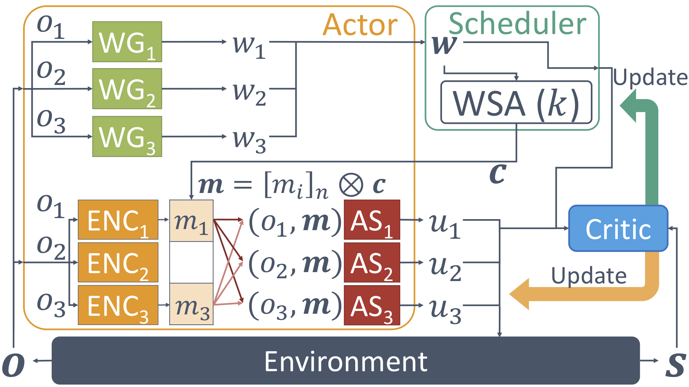
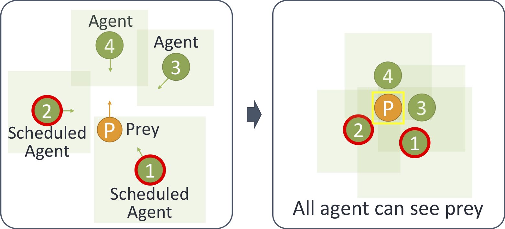
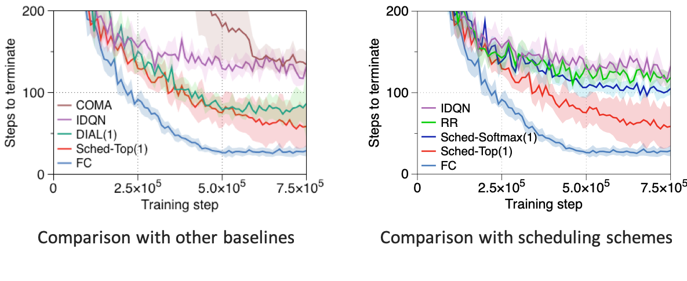
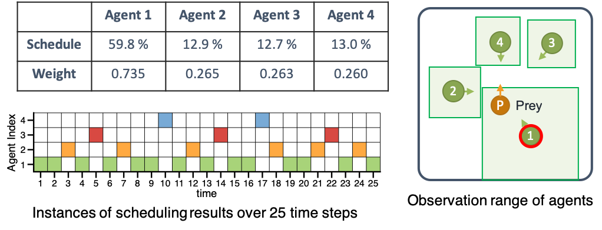
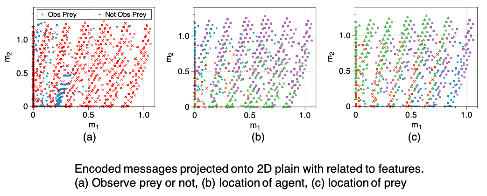

# Learning to Schedule Communication in Multi-agent Reinforcement Learning

This is the code for implementing the __SchedNet__ algorithm presented in the paper which will appear ICLR 2019: ["Learning to Schedule Communication in Multi-agent Reinforcement Learning"](http://lanada.kaist.ac.kr/Publication/Conference/Learning_to_schedule.pdf).

## Summary of the paper

In MARL (multi-agent reinforcement learning), well-coordinated actions
among the agents are crucial to achieve the target goal better at these tasks. One
way to accelerate the coordination effect is to enable multiple agents to communicate with each other in a distributed manner and behave as a group. In this paper,
we study a practical scenario when _(i)_ the communication bandwidth is limited
and _(ii)_ the agents share the communication medium so that only a restricted number of agents are able to simultaneously use the medium, as in the state-of-the-art
wireless networking standards. This calls for a certain form of communication
scheduling. In that regard, we propose a multi-agent deep reinforcement learning framework, called SchedNet, in which agents learn how to schedule themselves, how to encode the messages, and how to select actions based on received
messages. SchedNet is capable of deciding which agents should be entitled to
broadcasting their (encoded) messages, by learning the importance of each agent’s
partially observed information. 

### The overall architecture of SchedNet

- Actor: Collection of _n_ per-agent individual actor blocks (i.e., WG, ENC, AS)
- Scheduler: Map from weights __w__ to schedule profile __c__
- Critic: Estimates the action value function of actor




### Components of each agent in SchedNet

- Each block is fully connected neural network


- Distributed Execution
    - Determine the scheduling weight
    - k agents are scheduled by WSA
    - Scheduled agents to be broadcast message to all agents
    - Select an action based on observation and received messages


## How to run the code

```bash
git clone https://github.com/rhoowd/sched_net.git
cd sched_net
python main.py
```

## Environment: Predator and Prey (PP)

- _n_ agents try to capture a randomly moving prey
- Observation: Position of themselves, relative positions of prey (heterogeneous observation range)
- Action: Move up/down/leaf/right
- Reward: Get reward when they capture the prey
Performance metric: Number of steps taken to capture the prey




## Result

- Setup
    - Train the models until convergence
    - Evaluate models by averaging metrics for 1,000 iterations





- Communication improve the performance: SchedNET and DIAL outperform IDQN and COMA
- Consider the scheduling from training: Sched-Top(1) outperforms DIAL(1) which is trained without considering scheduling
- Intelligent scheduling: Sched-Top(1) improves the performance by 43% compared to Round Robin



- Importance-based scheduling
    - Instances of temporal scheduling profiles obtained during the execution
    - Agent 1 has a wider observation range
    - Agent 1 tends to obtain valuable observation more frequently
    - SchedNet schedules agent 1 more



- Message
    - What the agents communicate when performing the task
    - Observe prey: larger variance to include prey’s location information (red ‘x’ in (a))
    - Conditioned on success observation of prey:Message includes the information of agent’s location and prey’s location
